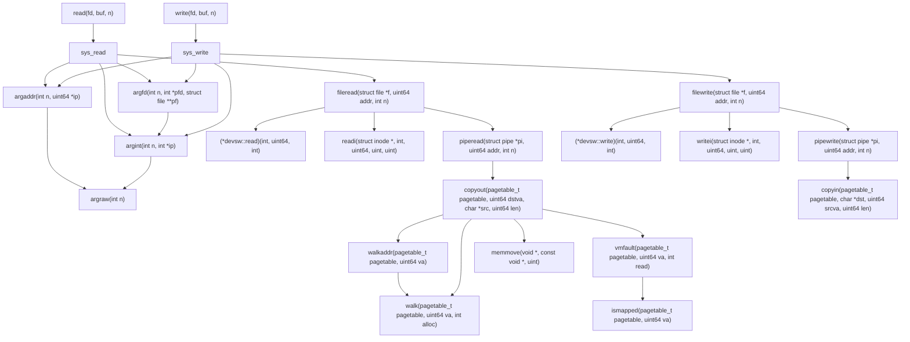

```mermaid
graph TD
A["read(fd, buf, n)"] --> AA[sys_read] --> AAA["argaddr(int n, uint64 *ip)"] --> AAAA["argraw(int n)"]
AA[sys_read] --> AAB["argint(int n, int *ip)"] --> AAAA
AA[sys_read] --> AAC["argfd(int n, int *pfd, struct file **pf)"] --> AAB
AA[sys_read] --> AAD["fileread(struct file *f, uint64 addr, int n)"] --> AADA["piperead(struct pipe *pi, uint64 addr, int n)"] --> AADAA["copyout(pagetable_t pagetable, uint64 dstva, char *src, uint64 len)"] --> AADAAA["walkaddr(pagetable_t pagetable, uint64 va)"] --> AADAAC
AAD --> AADB["(*devsw::read)(int, uint64, int)"]
AAD --> AADC["readi(struct inode *, int, uint64, uint, uint)"]
AADAA --> AADAAB["vmfault(pagetable_t pagetable, uint64 va, int read)"] --> AADAABA["ismapped(pagetable_t pagetable, uint64 va)
"]
AADAA --> AADAAC["walk(pagetable_t pagetable, uint64 va, int alloc)"]
AADAA --> AADAAD["memmove(void *, const void *, uint)"]

B["write(fd, buf, n)"] --> BA["sys_write"] --> AAA
BA --> AAB
BA --> AAC
BA --> BAA["filewrite(struct file *f, uint64 addr, int n)"]
BAA --> BAAA["pipewrite(struct pipe *pi, uint64 addr, int n)"] --> BAAAA["copyin(pagetable_t pagetable, char *dst, uint64 srcva, uint64 len)"]
BAA --> BAAB["(*devsw::write)(int, uint64, int)"]
BAA --> BAAC["writei(struct inode *, int, uint64, uint, uint)"]
```